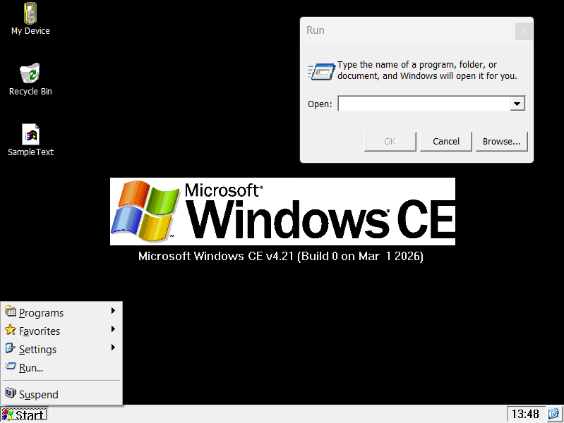

#  CERF - Windows CE Runtime Foundation

Run original Windows CE ARM applications on modern desktop Windows.



CERF emulates an ARM CPU and thunks WinCE COREDLL calls to native Win32 APIs, allowing unmodified ARM binaries to run on x64 Windows. The full WinCE boot sequence is emulated — device drivers, registry, shell, and explorer — giving each app a complete OS environment.

Successor to [wcecl](https://github.com/dz333n/wcecl).

## Usage

```
cerf.exe                              # Boot WinCE desktop
cerf.exe --device=wince6              # Boot with WinCE 6.0 profile
cerf.exe --no-init solitare.exe       # Launch app directly, skip boot
cerf.exe --gdb-port=1234              # Boot with GDB remote debugging
```

## Features

- **ARMv5TE emulation** — ARM + Thumb modes, real OS threads per ARM thread
- **Full boot sequence** — boot screen, device.exe drivers, HKLM\init with dependency ordering
- **Multi-process** — per-process virtual address space with copy-on-write DLL data isolation
- **Win32 API thunking** — GDI, windowing, dialogs, registry, filesystem, COM/OLE, sockets
- **WinCE theming** — system colors, UxTheme stripping, WinCE-style caption bars
- **Device profiles** — bundled configurations for WinCE 5.0, 6.0, and 7.0
- **GDB debugging** — remote stub for ARM code debugging
- **Only coredll is thunked** — all other WinCE DLLs (commctrl, ole32, aygshell, etc.) run as real ARM code

## Building

Requires Visual Studio 2022 with C++ desktop development workload.

```
msbuild cerf.sln /p:Configuration=Release /p:Platform=x64
```

## E2E Tests

```
python e2e_tests/run_all.py
```

Log-driven tests verify boot + app lifecycle across all device profiles.

## Documentation

See [docs/](docs/README.md) for architecture, boot sequence, process isolation, SEH, windowing, and thunking details.

## AI-Generated Codebase

This entire codebase was generated by [Claude](https://claude.ai) using [Claude Code](https://docs.anthropic.com/en/docs/claude-code). No human-written code. Contributions from both humans and Claude are welcome.

## Downloads

[](https://github.com/dz333n/cerf/actions/workflows/build.yml)

## License

[MIT](LICENSE)
